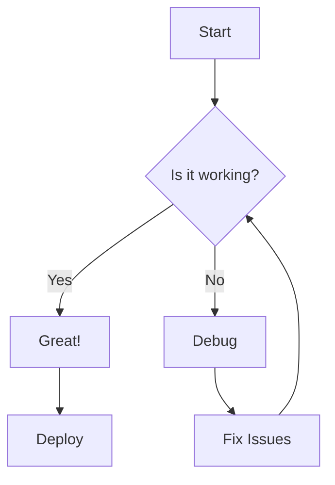
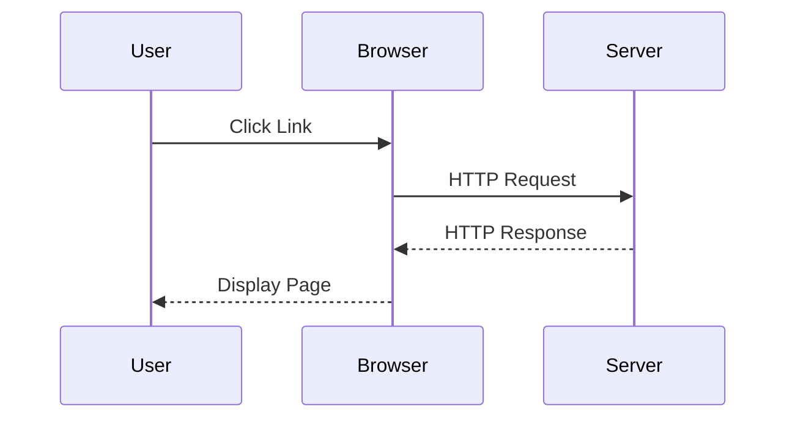
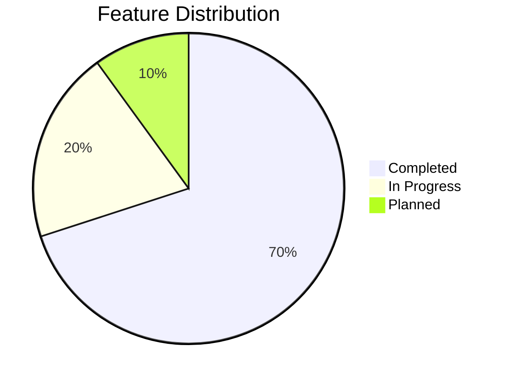

# 🧪 Complete Feature Test Suite

This document tests ALL features of the Markdown Viewer extension. Use this file to verify everything works correctly.

---

## 📝 Basic Typography

### Text Formatting

- **Bold text** using asterisks or underscores
- *Italic text* using asterisks or underscores  
- ***Bold and italic*** combined
- ~~Strikethrough text~~ using tildes
- ==Highlighted text== using double equals
- Superscript^text^ using carets
- Subscript~text~ using tildes

### Links

- [External link](https://github.com) to GitHub
- [Relative link](#all-features-test) to same document
- Auto-linked URL: <https://www.example.com>

### Horizontal Rules

***

---

___

## 🎯 Headings & Structure

# Heading 1

## Heading 2  

### Heading 3

#### Heading 4

##### Heading 5

###### Heading 6

### Setext Headings

Heading 1 Underline
=================

Heading 2 Underline
-----------------

## 📋 Lists

### Unordered Lists

- First item
- Second item
  - Nested item
  - Another nested item
- Third item
- Back to main level

### Ordered Lists

1. First step
2. Second step
3. Third step
   1. Nested numbered item
   2. Another nested item
4. Fourth step

### Task Lists

- [x] Completed task
- [ ] Incomplete task
- [x] Another completed task
- [ ] Task with **bold text**
- [ ] Task with `inline code`

### Definition Lists

Term 1
:   Definition for term 1
:   Extended definition

Term 2
:   Definition for term 2

Term 3 with *formatting*
:   Definition with **bold** and *italic*

## 💬 Blockquotes

### Simple Blockquote
>
> This is a simple blockquote.

### Nested Blockquotes
>
> Level 1 quote
> > Level 2 nested quote
> > > Level 3 deeply nested quote

### Blockquote with Formatting
>
> **Bold** in blockquote
> *Italic* in blockquote
> `Code` in blockquote
>
> Multiple paragraphs
>
> With [links](https://example.com)

## 🖼️ Images

### Local Images


### Remote Images


### With Titles (Caption Test)


## 🎨 Code Blocks

### Inline Code

This has `inline code` with **formatting** around it.

### Fenced Code Blocks

```javascript
function greet(name) {
  console.log(`Hello, ${name}!`);
  return true;
}

const result = greet("World");
```

### With Syntax Highlighting

```python
def fibonacci(n):
    if n <= 1:
        return n
    return fibonacci(n-1) + fibonacci(n-2)

# Calculate first 10 numbers
for i in range(10):
    print(f"F({i}) = {fibonacci(i)}")
```

### Multiple Languages

```css
.button {
  background: #0969da;
  color: white;
  padding: 12px 24px;
  border-radius: 6px;
}
```

```bash
#!/bin/bash
echo "Hello, World!"
git add .
git commit -m "Update features"
```

```sql
SELECT users.name, COUNT(posts.id) as post_count
FROM users 
LEFT JOIN posts ON users.id = posts.user_id
WHERE users.active = true
GROUP BY users.id
HAVING post_count > 5
ORDER BY post_count DESC;
```

### No Language (Plain Text)

```
This is plain text code
No syntax highlighting
Just monospace font
```

## 📊 Tables

### Basic Table

| Header 1 | Header 2 | Header 3 |
|----------|----------|----------|
| Cell 1   | Cell 2   | Cell 3   |
| Cell 4   | Cell 5   | Cell 6   |
| Cell 7   | Cell 8   | Cell 9   |

### With Alignment

| Left Aligned | Center Aligned | Right Aligned |
|:-------------|:--------------:|--------------:|
| Left         | Center         | Right          |
| Data         | Data           | Data           |

### Complex Table

| Feature | Status | Priority | Assignee |
|---------|--------|----------|----------|
| Search  | ✅ Done | High     | @dev     |
| Export  | 🚧 WIP  | Medium  | @dev2    |
| Print   | 📋 Todo | Low     | @dev3    |

## 🎯 Mermaid Diagrams

### Flowchart



### Sequence Diagram



### Pie Chart



## 🔢 Math & Science

### Inline Math

The Pythagorean theorem: $a^2 + b^2 = c^2$

Euler's identity: $e^{i\pi} + 1 = 0$

### Block Math (if KaTeX/MathJax supported)

$$
\frac{-b \pm \sqrt{b^2 - 4ac}}{2a}
$$

## 🔗 Advanced Links

### With Titles

[GitHub](https://github.com "GitHub Homepage")

### Reference Style Links

[GitHub][1]
[Google][2]

[1]: https://github.com "GitHub"
[2]: https://google.com "Google"

## 📑 Document Structure

### Cross-Document Links (if supported)

- Link to [another document](another-file.md)
- Link to [specific section](another-file.md#section-title)

### Anchor Links

- [Jump to Code Blocks](#-code-blocks)
- [Jump to Tables](#-tables)
- [Jump to Mermaid](#-mermaid-diagrams)

## 🎨 Advanced Formatting

### Combined Formatting

This has **bold with *italic* inside** and `code` too.

### Line Breaks

First line  
Second line (two spaces + enter)  
Third line

### Hard Line Breaks

First line<br>
Second line using HTML tag<br>
Third line

## 🌐 Special Characters

### HTML Entities

&copy; 2024 Markdown Viewer  
&reg; Registered Trademark  
&trade; Trademark  
&euro; € &pound; £ &yen; ¥  

### Emojis (if supported)

:smile: :heart: :thumbsup: :rocket: :star: :fire: :100:

## 📱 Responsive Elements

### Long URL Testing

<https://very-long-domain-name.example.com/with/very/long/path/that/should/wrap/on/mobile/devices>

### Code Wrap Testing

```python
this_is_a_very_long_variable_name_that_should_wrap_properly_on_smaller_screens_without_breaking_the_layout = function()
```

## 🎯 Performance Testing

### Large Content

#### Repeated Content for Performance Testing

Lorem ipsum dolor sit amet, consectetur adipiscing elit. Sed do eiusmod tempor incididunt ut labore et dolore magna aliqua. Ut enim ad minim veniam, quis nostrud exercitation ullamco laboris nisi ut aliquip ex ea commodo consequat.

**Bold** and *italic* and `code` throughout the document to test rendering performance with many highlights.

#### Repeated Sections

- Test item 1
- Test item 2  
- Test item 3
- Test item 4
- Test item 5

1. Numbered item 1
2. Numbered item 2
3. Numbered item 3
4. Numbered item 4
5. Numbered item 5

## 🔍 Search Testing

### Search Terms to Try

Search for these terms to test the search functionality:

- **"test"** - appears multiple times
- **"item"** - appears in lists
- **"code"** - appears in headings and code blocks
- **"Lorem"** - appears in performance section
- **"function"** - appears in code blocks (should be excluded)

### Edge Cases

- Search for **"&"** - special characters
- Search for **"()"** - parentheses
- Search for **"--"** - dashes
- Search for **"[]()"** - markdown syntax characters

## 🎨 Theme Testing

### Dark/Light Mode Elements

This document should look good in both light and dark themes. Test the theme toggle button to see how all elements adapt:

- **Text readability** in both themes
- **Code block** contrast
- **Table** borders and backgrounds  
- **Blockquote** styling
- **Link** colors and hover states

## 📊 Statistics & Metrics

### Document Info

- **Total headings**: Count manually or use TOC
- **Total code blocks**: 6+ blocks
- **Total tables**: 3 tables
- **Total diagrams**: 3 Mermaid diagrams
- **Word count**: (Check word count in editor mode)

---

## 🎯 Feature Checklist

Use this section to verify all features work:

### Rendering

- [ ] Headings (H1-H6) render correctly
- [ ] Text formatting (bold, italic, strikethrough, highlight) works
- [ ] Links (external, internal, auto-linked) function properly
- [ ] Images load and display correctly
- [ ] Lists (ordered, unordered, nested) render properly
- [ ] Task lists show checkboxes correctly
- [ ] Code blocks have syntax highlighting
- [ ] Tables render with proper alignment
- [ ] Blockquotes display correctly
- [ ] Mermaid diagrams render and are interactive

### Interactive Features  

- [ ] Search works and highlights matches
- [ ] TOC is generated and allows navigation
- [ ] Copy buttons work in code blocks
- [ ] Image lightbox opens on click
- [ ] Diagram lightbox works
- [ ] Theme toggle switches between light/dark
- [ ] View/Edit/Split modes function correctly
- [ ] Scroll sync works in split mode
- [ ] Keyboard shortcuts work (Ctrl+F, Ctrl+S, etc.)

### Advanced Features

- [ ] Definition lists render properly
- [ ] Math equations render (if supported)
- [ ] Footnotes work (if implemented)
- [ ] Emoji shortcodes display (if supported)
- [ ] File navigation works (if implemented)

---

## 🏗️ Footer Content

### Additional Testing
>
> "The best way to test the future is to create it." - Anonymous

```javascript
// Final code block for testing
console.log("Feature test complete!");
return true;
```

| Status | Feature | Notes |
|--------|---------|-------|
| ✅ | Basic Markdown | All standard elements work |
| ✅ | Advanced Features | Diagrams, tables, etc. work |
| ✅ | Interactive | Search, TOC, themes work |
| ⏳ | Experimental | Some features may be in development |

**Test completed!** 🎉

---

*Last updated: 2024-06-15*  
*Purpose: Comprehensive testing of all Markdown Viewer features*
