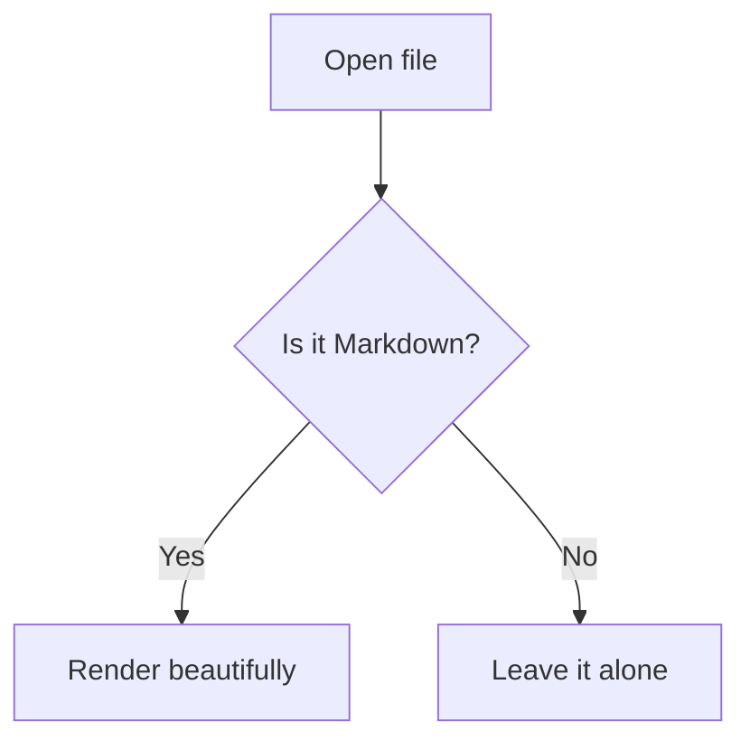

# Markdown Viewer & Editor

> Open any `.md` file in your browser and get a beautiful, GitHub-style reading experience — with a built-in editor, live preview, Mermaid diagrams, and dark mode. No account. No cloud. No telemetry.


---

## Why this extension?

Most Markdown viewers either require a paid app, force you through a web service, or look like a plain text dump. This extension renders your files **instantly, locally, and beautifully** — straight from your file system or the web. Switch to the editor, make changes, and save them back to disk. Everything runs in the browser; nothing leaves your machine.

---

## Features at a glance

### Reading

- **Auto-renders** `.md`, `.markdown`, `.mdown`, `.mkd`, `.mkdn`, `.mdwn`, `.mdtext` — open a file and it just works
- **GitHub Flavored Markdown** — tables, task lists, fenced code blocks, strikethrough, highlights, superscript, nested blockquotes
- **Syntax highlighting** for 15+ languages — JavaScript, TypeScript, Python, Java, Go, Rust, C#, PHP, Ruby, Swift, Kotlin, SQL, Bash, CSS, HTML, JSON, YAML
- **Mermaid diagram support** — flowcharts, sequence diagrams, Gantt charts, and more render inline automatically
- **Collapsible TOC sidebar** — always-visible table of contents with scroll-spy; shrinks to an icon strip so it never gets in the way
- **Dark / Light / Auto theme** — matches your OS preference and remembers your choice
- **Raw ↔ Rendered** toggle — inspect the original source any time
- **Copy button** on every code block
- **Print-friendly** output

### Editing

- **Three modes** — View, Edit, and side-by-side Split with live preview as you type
- **Format toolbar** — H1–H3, Bold, Italic, Strikethrough, Link, Image, Inline Code, Code Block, Lists, Task List, Blockquote, Table, HR
- **Keyboard shortcuts** — `Ctrl+B` Bold · `Ctrl+I` Italic · `Ctrl+K` Link · `Ctrl+E` Inline Code · `Ctrl+S` Save
- **Smart editing** — Tab/Shift+Tab indent, auto-continue list items on Enter, scroll sync in Split mode
- **Save back to disk** — uses the File System Access API; falls back to download
- **Word & character count** live in the toolbar

---

## Installation

### Chrome / Edge

1. Download or clone this repository
2. Go to `chrome://extensions`
3. Enable **Developer mode** (toggle in the top-right)
4. Click **Load unpacked** and select the `markdown-viewer` folder
5. On the extension card, click **Details** → enable **Allow access to file URLs**

### Firefox

1. Go to `about:debugging` → **This Firefox**
2. Click **Load Temporary Add-on**
3. Select `manifest.json` inside the folder

> **File access note:** step 5 (Chrome/Edge) is required to render local `.md` files from your disk. Web-hosted Markdown files work without it.

---

## Quick start

1. Open any `.md` file locally (`File → Open` in Chrome, or drag it into a tab)
2. The extension renders it automatically — no click needed
3. Use the **sidebar** to navigate headings; click the panel icon to collapse it
4. Click **Raw** to see the source; click again to go back
5. Switch to **Edit** or **Split** mode to make changes, then hit `Ctrl+S` to save

### Mermaid diagrams

Fenced code blocks with the `mermaid` language tag render as interactive diagrams:

````markdown

````

The Mermaid badge in the toolbar confirms diagram support is active. Theme updates (light ↔ dark) re-render diagrams automatically.

---

## Keyboard shortcuts

| Shortcut | Action |
| :--- | :--- |
| `Ctrl+B` | Bold |
| `Ctrl+I` | Italic |
| `Ctrl+K` | Insert link |
| `Ctrl+E` | Inline code |
| `Ctrl+S` | Save file |

---

## File structure

```text
markdown-viewer/
├── manifest.json       # MV3 extension manifest
├── content.js          # Parser, renderer, highlighter, editor logic
├── content.css         # Light/dark themes, responsive layout
├── background.js       # Service worker — storage init, badge updates
├── bridge.js           # Main-world bridge for Mermaid rendering
├── mermaid.min.js      # Mermaid library (bundled, no CDN call)
├── popup.html/js/css   # Extension popup (theme & font size)
├── test.md             # Feature showcase file
└── icons/
    ├── icon16.png
    ├── icon48.png
    └── icon128.png
```

---

## Browser compatibility

| Browser | Version | Status |
| :--- | :--- | :--- |
| Chrome | 88+ | ✅ Full support |
| Edge | 88+ | ✅ Full support |
| Firefox | 109+ | ✅ Full support (MV3) |
| Safari | — | ❌ No MV3 WebExtensions |

---

## Development

No build step, no toolchain. Edit source files directly and reload.

**After making changes:**

- Chrome/Edge: `chrome://extensions` → refresh icon on the card
- Firefox: `about:debugging` → **Reload**

Open `test.md` in the browser after loading to verify all features.

---

## License

MIT — free to use, modify, and distribute.
